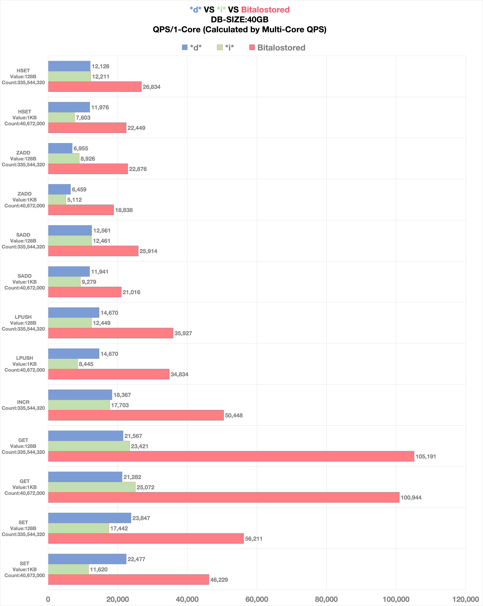
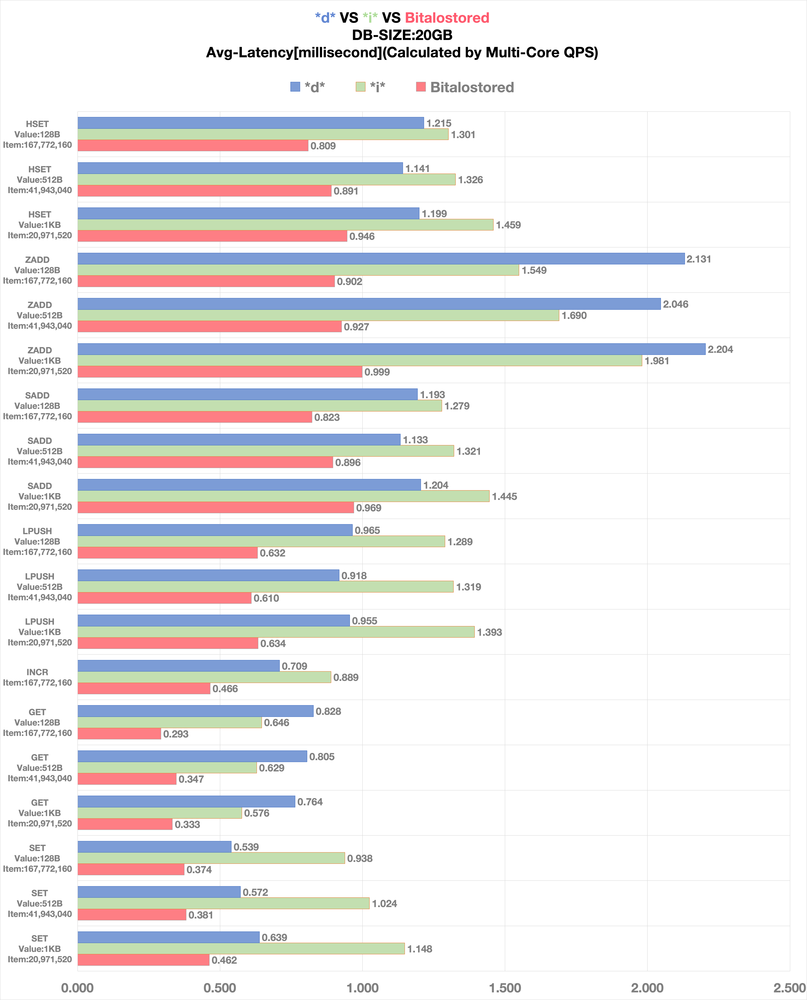

## 简介

- 高性能分布式存储系统，核心引擎基于[bitalosdb](https://git.zuoyebang.cc/stored-bitalosdb/bitalosdb/README_CN.md)，兼容redis协议；作为redis的替代品，用成本更低的硬盘存储数据，充分发挥多核优势，且单核性能优秀，可大幅降低服务成本。

- 开源版本，集成dashboard（可视化管理平台）、stored（存储服务）、proxy（代理服务）于一体，是完整的工业级解决方案。经历作业帮100+个集群的实践验证，存储200TB数据，峰值QPS：2000万，峰值带宽：5000Gbps；2019年发布v1.0至今线上零事故。

## 出品

- 团队：作业帮-平台技术团队

- 作者：徐锐波(hustxrb@163.com)

- 贡献者：幸福(wzxingfu@gmail.com)、卢文伟(422213023@qq.com)、刘方(killcode13@sina.com)、李景晨(cokin.lee@outlook.com)

## 关键技术

- 兼容redis协议，接入成本低；支持大部分命令，包括LUA、分布式事务。

- 高性能内核，装备自研KV引擎：bitalosdb，较之rocksdb，性能大幅领先。

- 高性能数据一致性架构，基于bitalos-raft，深度优化Raft协议，显著提升写性能，并具备更稳定的选举策略和数据同步流程。

- 高性能存储结构，压缩redis复合数据类型，大幅降低IO成本，提升系统吞吐。

- 多云容灾，支持多机房或多云部署&管理，拥有完整的降级&容灾方案。

- 多主写入（企业版支持），基于CRDT，优化数据同步及一致性策略，确保单分片多主写入时能自适应解决冲突，并达成最终一致。

## 快速部署

- 适用场景：单机部署测试集群，体验dashboard、proxy、stored各组件功能及集群运维

- 部署脚本：install.sh，按提示输入分片数(group)、从节点数(slave)、证人节点数(witness)；默认数量：proxy * 1、group * 2(master * 2、slave * 2、witness * 2)

- 管理后台：127.0.0.1:8080，默认用户&密码均为demo

- 服务地址：127.0.0.1:8790，命令行直连，redis-cli -h 127.0.0.1 -p 8790

- 卸载脚本：uninstall.sh

## 性能报告

- bitalostored在性能上持续精进，此次性能测试基于bitalostored v5.0；当前有数款知名的开源存储系统（兼容redis协议），同为redis的替代品，选取其中性能优秀的两款产品（\*d\* 与 \*i\*）做性能对比。

### 硬件

```
CPU:    Intel(R) Xeon(R) Platinum 8255C CPU @ 2.50GHz
Memory: 384GB
Disk:   2*3.5TB NVMe SSD
```

### 程序

- 压测工具：redis官方memtier_benchmark

- 存储服务：线程数（8）、CPU限制（8核）

- 压测命令：--data-size=1024｜128、-n=40672038｜335544320

```
./memtier_benchmark -t 8 -c 16 -s 127.0.0.1 -p xxxx --distinct-client-seed --command="set __key__ __data__" --key-prefix="performance_test_key_prefix_" --key-minimum=1 --key-maximum=40672038 --random-data --data-size=1024 -n 317750
./memtier_benchmark -t 8 -c 16 -s 127.0.0.1 -p xxxx --distinct-client-seed --command="get __key__" --key-prefix="performance_test_key_prefix_" --key-minimum=1 --key-maximum=40672038 --test-time=300
./memtier_benchmark -t 8 -c 16 -s 127.0.0.1 -p xxxx --distinct-client-seed --command="incr __key__" --key-prefix="int_" --key-minimum=1 --key-maximum=40672038 --random-data --data-size=1024 -n 317750
./memtier_benchmark -t 8 -c 16 -s 127.0.0.1 -p xxxx --distinct-client-seed --command="lpush __key__ __data__" --key-prefix="list_" --key-minimum=1 --key-maximum=40672038 --random-data --data-size=1024 -n 317750
./memtier_benchmark -t 8 -c 16 -s 127.0.0.1 -p xxxx --distinct-client-seed --command="sadd __key__ __data__" --key-prefix="set_" --key-minimum=1 --key-maximum=40672038 --random-data --data-size=1024 -n 317750
./memtier_benchmark -t 8 -c 16 -s 127.0.0.1 -p xxxx --distinct-client-seed --command="zadd __key__ __key__ __data__" --key-prefix="" --key-minimum=1 --key-maximum=40672038 --random-data --data-size=1024 -n 317750
./memtier_benchmark -t 8 -c 16 -s 127.0.0.1 -p xxxx --distinct-client-seed --command="hset __key__ __data__ __key__" --key-prefix="hash_" --key-minimum=1 --key-maximum=40672038 --random-data --data-size=1024 -n 317750
```

### 数据

- 数据总量：40GB

- 对比维度：命令（SET、GET、INCR、LPUSH、SADD、ZADD、HSET） x 数据大小&条数（1KB & 40,672,000、128B & 335,544,320）

- 对比标准：多核压测QPS换算成单核QPS对比，单核性能更能体现成本优势

### 配置

- \*d\* & \*i\*

```
Threads:8
Memtable：512MB
WAL：enable
Binlog：disable
Cache：40GB

其余参数使用官方推荐压测配置
```

- bitalostored

```
Threads:8
Memtable：512MB
WAL：enable
Raftlog：disable
Cache：20GB
```

### 结果

- QPS ([Horizontal](./docs/benchmark-qps.png))



- Latency ([Horizontal](./docs/benchmark-latency.png))



## 文档

- 技术架构和文档，参考官网：bitalos.zuoyebang.com

## 技术积累(bitalosearch)

- 高性能分布式检索&分析引擎，SQL协议，主打AP场景，并具备一定的TP能力；正在内部实践，开源计划待定

- bitalosearch较之elasticsearch，成本优势明显；硬盘消耗，节省30%；数据写入，性能提升25%；复杂分析逻辑，性能提升20%～500%